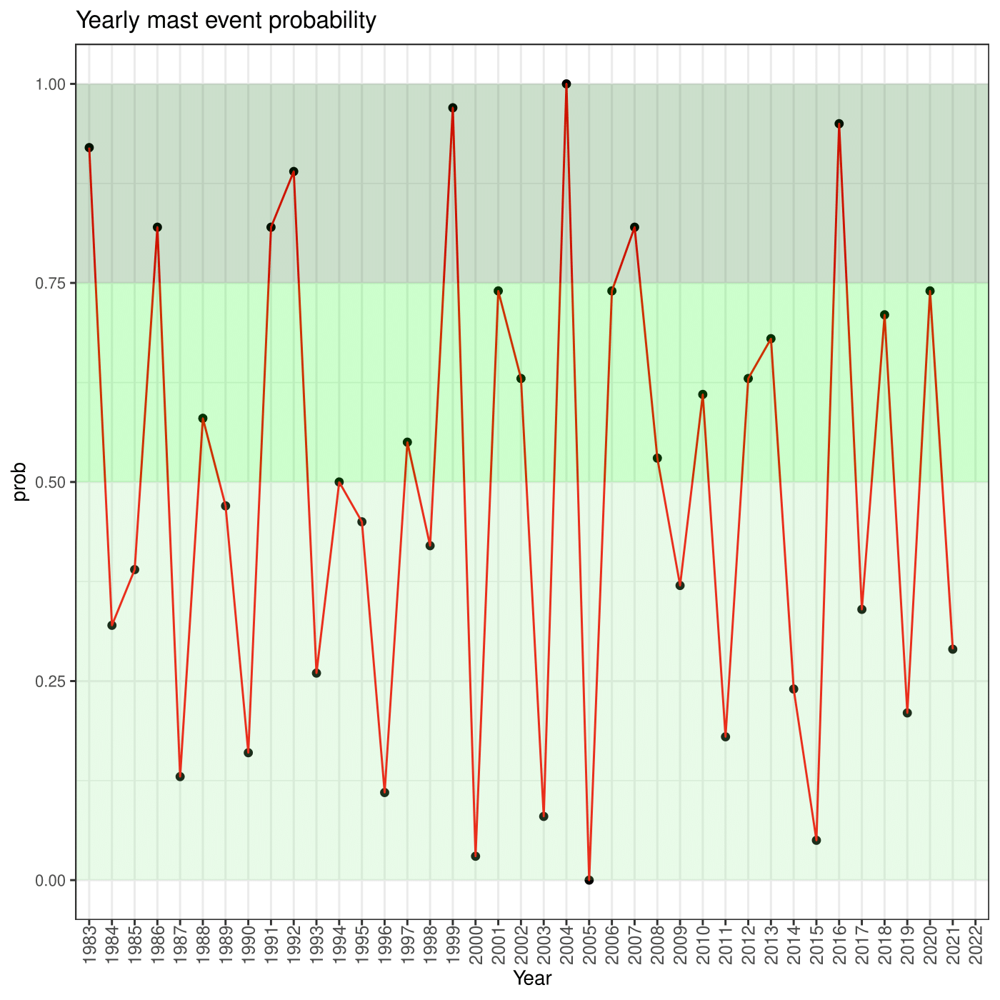

# foreMast


This package is a tool that can be used to forecast masting events of European beech (*Fagus sylvatica L.*) based on monthly climatic cues (precipitation and mean temperature) which are available from the Copernicus ERA-5 Climate Data Hub

## Installation
The package can be installed typing:
```r
# install.packages(devtools) #uncomment if you need to install devtools pkg
library(devtools)
devtools::install_github("uchiavetta/foreMast", build_vignettes = F, upgrade = F)
```

## Functions
The package is composed by three functions:

### a) cdsDownload(U_ID, API_Key, lat, lon, sPath, site_id = "")
This function allow to download the data of the monthly average temperatures and total precipitations, from 1981 to the current date. The data come from the "ERA5-Land monthly averaged data from 1981 to present". They are downloaded via the Copernicus CDS API, therefore the registration is required https://cds.climate.copernicus.eu/#!/home.
Before you can download any data you have to make sure to accept the terms and conditions here: 
https://cds.climate.copernicus.eu/cdsapp/#!/terms/licence-to-use-copernicus-products.
On the user page, the UID and API Key are reported, which are needed as parameters for the function that works as follow:
```r
library(foreMast)
user = "xxxxx" 
key = "xxxxxxxx-xxxx-xxxx-xxxx-xxxxxxxxxxxx" #use the UID and the API key in your Copernicus CDS User profile
N = 43.2 
E = 11.3 #for southing and westing coordinates use negative values
siteId = "siteName" #it will be attached to the name of the file to be downloaded, along with the user id
dir = "~/download" #insert the path for the directory where the file should be downloaded

cdsDownload(U_ID = user, API_Key = key, lat = N, lon = E, sPath = dir, site_id = "")
```
After that, a file with the NetCDF extension (.nc) will be saved in the directory passed as parameter, containing all the neded data.

### b) mastFaSyl(fName)
This function is the core of the package and contains the algorithm that calculate the mast probability, given the downloaded file with the climate cues, returning as output a table with one column containing the year series and a second one with the predicted probability (calculated as percent rank):

```r
# library(foreMast)
data = "~/download/xxxxx_siteName_t2p_tp.nc"
mast = mastFaSyl(fName = data)
```
### c) mastPlot(prediction)
This third function takes the previous function output and plots it returning a line chart divided in three main areas: 
1. a lightgreen one for the values that go from 0 to 0.5 (low seed production probability); 
2. a green one for the values between 0.5 and 0.75 (medium seed production probability);
3. a darkgreen one for the values that go from 0.75 and 1 (high/very high large seed production probability).

```r
# library(foreMast)
# mast = mastFaSyl(fName = data)
chart = mastPlot(prediction = mast)
plot(chart)
```

