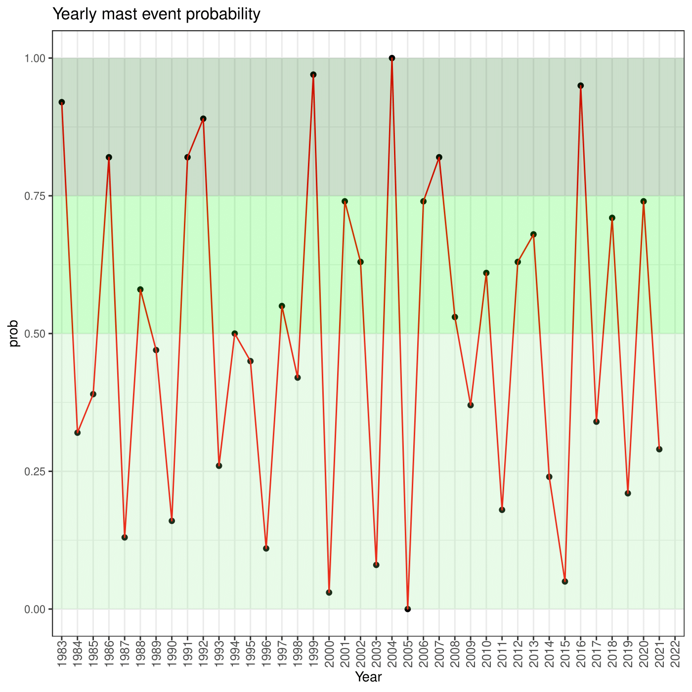

```{r, include = FALSE}
knitr::opts_chunk$set(
  collapse = TRUE,
  comment = "#>"
)
```

```{r setup}
library(foreMast)
```


## 1.Seed production calculation

The `mastFaSyl` function calculates the probabilty of beech seed production for a given site, taking a NetCDF file (or a list of them) downloaded with the `cdsDownload` function or already present in a directory, or a csv with data of a specific location. In the last case, the latitude and the longitude of the site from where the observations have been recorded mus be passed as parameters in the function. 
IMPORTANT: the csv file must have 3 columns with this order: 
- column 1: list of years of the observations;
- column 2: mean summer temperatures calculated with those of June, July and August;
- column 3: mean summer precipitation calculated as before
Remind that it is not important the name of the column but the order.

At the beginning, the function check if the file loaded is a `nc` file or a `csv`: in the first case the .nc file is opened using the necdf4 package's function `nc_open`. The coordinates are extracted and a list of year is defined (starting from the first available year in the records and ending in the current year) which will be used for later operations:

```{r, eval = F}
nc <- ncdf4::nc_open(fName)
data.years <- ncdf4::ncvar_get(nc,"time")
lat <- base::round(ncdf4::ncvar_get(nc, "latitude"), 2)
lon <- base::round(ncdf4::ncvar_get(nc, "longitude"), 2)

# this function extracts the time from the nc file, converting it from seconds-from-1900 to year
conversion <- function(x){
  converted <- base::floor((x/24)/365)
  converted <- converted + 1900
}

data.year <- base::lapply(data.years, conversion)
start.year <- data.year[[1]]
```

Successively, for each climatic variable, the summer mean is calculated (June/July/August) over the series of years set before, obtaining a temperature and precipitation time series:

```{r, eval = F}
# time series of the climate variables
t2m <- stats::ts(ncdf4::ncvar_get(nc, varid= "t2m" )-273.15, frequency = 12,
                 start = c(as.numeric(start.year, 1)))
tp <- stats::ts(ncdf4::ncvar_get(nc, varid= "tp" )*1000, frequency = 12)

Tmean.df <- data.frame(stats::.preformat.ts(t2m), stringsAsFactors = FALSE) # from time series to data frame
Tmean.s <- t <- (as.numeric(Tmean.df$Jun) + as.numeric(Tmean.df$Jul) + as.numeric(Tmean.df$Aug))/3

P.df <- data.frame(stats::.preformat.ts(tp),stringsAsFactors = FALSE)
P.s <- p <- (as.numeric(P.df$Jun) + as.numeric(P.df$Jul) + as.numeric(P.df$Aug))/3
```

If the file passed through `fName` is a csv, lat and lon paramters are checked in order to see if they have been passed to the function. If they have, the years, temperatures and precipitations are extracted similarly as for the nc file, in order to be used to calculate the seed production probability:

```{r, eval = F}
if(is.null(lat) | is.null(lon)){
      stop("Error: please insert lat and lon")
    } else {
      climateDf <- utils::read.csv(fName)
      start.year <- min(climateDf[1])

      t <- climateDf[2][1:nrow(climateDf), ]
      p <- climateDf[3][1:nrow(climateDf), ]
    }
```

Once the series are ready, the seed production is calculated as follow:

```{r, eval = F}
ffst0 <- function(t, p, start.year, wt=NULL, wp=NULL, wsp = 0.5){
    if(length(t)!=length(p)){
      options(error = NULL)
      stop("Error: t and p must have same length")
    } else {
      st1 <- (wt*(dplyr::percent_rank(dplyr::lag(t,0)))+wp*(1-dplyr::percent_rank(dplyr::lag(p,0))))/(wp+wt)
      st2 <- (wt*(1-dplyr::percent_rank(dplyr::lag(t,1)))+wp*(dplyr::percent_rank(dplyr::lag(p,1))))/(wp+wt)
      st0 <- round((st2+st1)/2,2)
      sp <- (1-(dplyr::percent_rank(dplyr::lag(c(st0,0.5), 1)))[-1]^2)
      st0p <- round(dplyr::percent_rank((st2+st1+wsp*sp)/(2+wsp)),2)
      years <- (syear+2):(syear+length(t))
      return(data.frame('Year' = as.character(years), 'prob' = (st0p[-1])))
    }

  }
```

where `t` and `p` are the time series, `wt`, `wp`, and `wsp` are the weights of the temperature, precipitation and autocorrelation.
To calculate wt and wp there are three options, depending on two function parameters, `weighting` and `weights`:
1) when `weighting = "standard"`, wt and wp become 3 and 1 respectively, which is the average best weight combination 
among all those tried comparing field data with the forecast of the algorithm;
2) when `weighting = "auto"`, wt and wp are the best performing weights values of the nearest site belonging to the
MASTREE dataset, used to evalute the algorithm performance in relation to the observed data in the field;
3) when `weighting = "manual"`, the weights must be manually inserted using `weights`.

Succesively, the function `ffst0` calculates the percent rank of the climate variables in the two years before the year to be predicted, in relation to the weight of the climate cues and to an autocorrelation factor. As result, it returns a data frame with a column for the years and a second one with the seed production probability (calculated as percent rank):

```{eval = F}
 year | prob
 -----|-----
 1983 | 0.88
 2018 | 0.70
 2019 | 0.23
 2020 | 0.74
 2021 | 0.27
```
 
 Before returning the data frame, an if statement checks whether the user has inserted the parameter related to 
 adverse events (late frost or summer drought) in the current year. If yes, the probability for the current year 
 is set to 0.
 
 ## 2.Data plotting
 
In the end, the data frame is returned and passed to the `probPlot` function that plots the results as a line chart:

```{r, eval = F}
  Year <- prob <- NULL
  mast_plot <- ggplot2::ggplot(prediction, ggplot2::aes(x = Year, y = prob, group = 1)) +
    ggplot2::geom_point() +
    ggplot2::geom_line(color = "red") +
    # the chart space is divided in the strips in relation to the probability value
    ggplot2::annotate('rect', xmin = -Inf, xmax = Inf, ymin = .75, ymax = 1, alpha = .2, fill = 'darkgreen') +
    ggplot2::annotate('rect', xmin = -Inf, xmax = Inf, ymin = .5, ymax = .75, alpha = .2, fill = 'green') +
    ggplot2::annotate('rect', xmin = -Inf, xmax = Inf, ymin = 0, ymax = .5, alpha = .2, fill = 'lightgreen') +
    ggplot2::ggtitle('Yearly mast event probability') +
    ggplot2::theme_bw() %+replace% 
    ggplot2::theme(text = ggplot2::element_text(size=10),
                   axis.text.x = ggplot2::element_text(angle = 90, vjust = 0.5, size= 9))
```

{width=550px}
